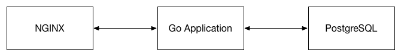

# To-Do API

This is a backend for managing a simple task management application.
The backend consists of three different parts:

- Go application
- PostgreSQL
- NGINX

En översikt hur de hänger ihop kan ses här:

## Go application

In order to run the application, you need one dependency: "github.com/lib/pq".
This can be retrieved by running `go get`.

You may want to update the database information to match your system.
Update the following constants in todo.go:

- databaseUser
- databaseHost
- databaseName

## PostgreSQL database

PostgreSQL is used to store all the list and todo information.
In order to setup the database schema, run `psql -f schema.sql db_name`.

## NGINX

There is a configuration ready for using NGINX as a reverse proxy (in `nginx.conf`).
However, the url to the application may need to be updated.

## Run

To build to application, simply use `go build` in the project directory.
You can also use `go run todo.go` to run the server directly.

## Test

Test the system to make sure everything works.
This is done by running `go test` in the application folder.
